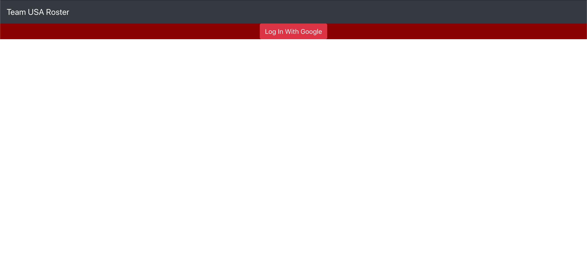
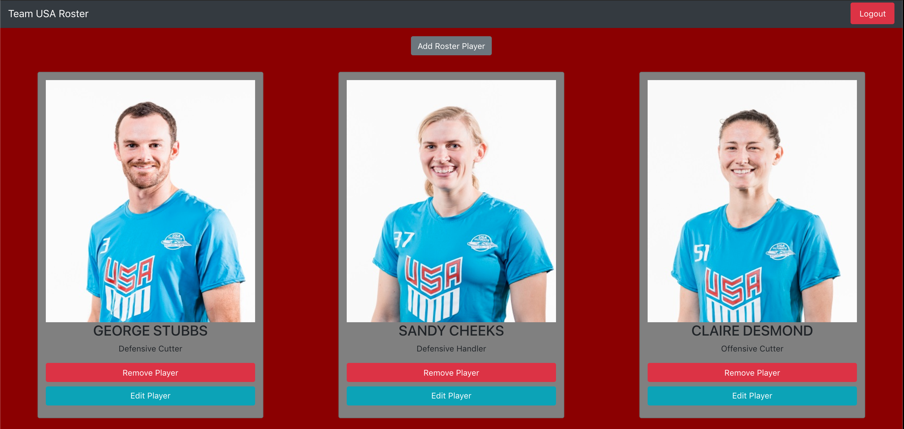
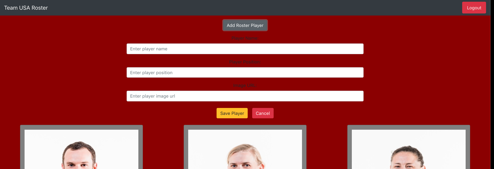
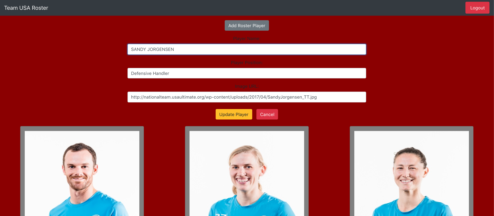

# TEAM USA:  Ultimate Frisbee National Team Roster

## Description
Use this application to view and manipulate the members of the US National team. When authenticated, users can add new players to the roster, edit existing players and remove players. 

## Screenshots

## How To Run
- Clone down the project
- In the terminal run npm install
- Create a firebase project here
- Create `src/helpers/apiKeys.json` file and add in your firebase keys that were created in the new firebase project. Feel free to reference the `apiKeys.example.json` file in the project for the correct structure.
- Once set up to run enter the following in the terminal run `npm start`